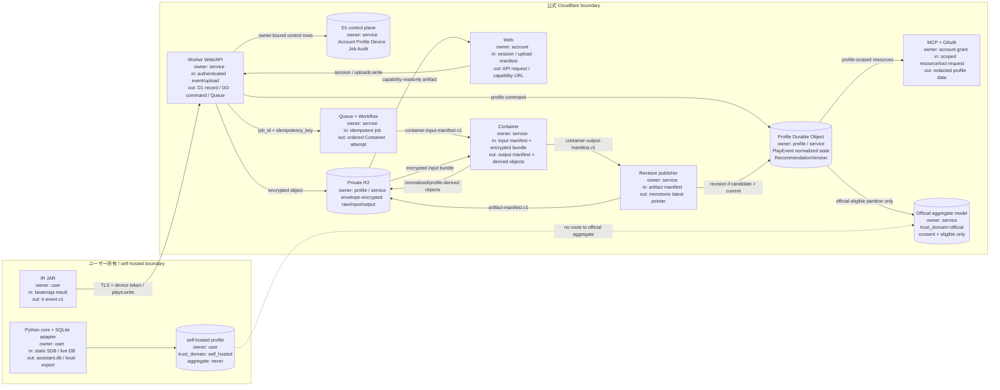

# サービス境界と責務

## 一枚で追跡できるデータフロー

矢印のラベルは主な入力 → 出力、ノード内の `owner` はデータ所有者、`boundary` は信頼境界を示します。

## コンポーネント契約

| コンポーネント | 入力 | 出力 | 所有者 | 境界・禁止事項 |
|---|---|---|---|---|
| beatoraja IR JAR | プレイ結果、allowlist 済み chart 情報 | `ir-event.v1` | ユーザー | BMS本体、replay `keyinput`、任意 `values` は送信しない |
| Python core / local adapter | 5DB の read-only snapshot または live DB | `assistant.db`、ローカル export | ユーザー | beatoraja DBへ書かない。self-hosted データは公式集合へ入れない |
| Web | 認証済み操作、manifest | API request、capability URL | Account | URLに account/profile ID や秘密値を再掲しない |
| Worker / API | bearer credential、契約 JSON | D1/DO command、暗号化 object、job | Service | owner は credential から決定。request body の owner は信用しない |
| D1 | Account/Profile/Device/Job/Audit の制御行 | owner・status・hash・pointer | Service | 生DB、平文 token、MCP用生イベント本文を置かない |
| Profile DO | profile-scoped event/job/revision command | immutable PlayEvent、model/revision state | Profile owner | account/profile 越境 read/write を拒否 |
| Private R2 | encrypted raw/input/output/artifact | hash付き object | Profile owner / Service | profile prefix と envelope key を強制。MCPから raw object を返さない |
| Queue / Workflow | job envelope、idempotency key | retryable Container attempt | Service | duplicate delivery 前提。順序は保証せず latest pointer は revision 比較で保護 |
| Container | container input manifest、encrypted bundle | output manifest、derived object | Service | raw DBをモデル入力へ直接渡さない。SP7 以外を reject |
| Revision publisher | output/artifact manifest | immutable release、latest pointer candidate | Profile owner | `candidate_revision > current_revision` の時だけ pointer 更新 |
| MCP + OAuth | PKCE token、scope付き resource/tool | redacted profile data | Account grant | `plays:read` なしに詳細履歴不可。生DB・pending提案・秘密を公開しない |
| Official aggregate | official partition の eligible derived data | 匿名集合モデル | Service / consenting users | `trust_domain=official` かつ `aggregate_eligible=true` のみ。self-hosted UNION は禁止 |

## 分離不変条件

1. `trust_domain` は client payload ではなく、認証済み device/upload context から Worker が付与し、以後 immutable にする。
2. `official` と `self_hosted` は R2 prefix、DO stream、job partition、aggregate input query のキーに含める。同じ profile ID の文字列だけで越境参照できない。
3. 集合学習の入力は `trust_domain=official`、明示同意、`aggregate_eligible=true`、初期範囲 `SP7` をすべて満たす derived record に限る。raw 5DB は常に対象外。
4. `is_course=true` の PlayEvent は個人の履歴・品質には保存するが、通常曲の個人モデル学習へは入れない。
5. 初期範囲外の `DP14`、`DP7`、`PMS`、その他の rule/game mode は、入口・Container・aggregate query の3箇所で拒否する。
