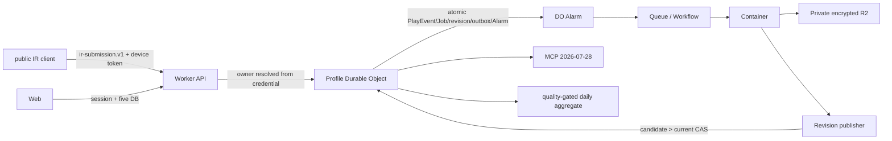

# 公式サービス境界と責務

v1は日本・日本語・公式Cloudflare・SP7通常曲だけを対象とする。runtime実装はこの契約issueの対象外。

| コンポーネント | 入力 | 出力 | データowner | 信頼境界・禁止事項 |
|---|---|---|---|---|
| public IR client | beatorajaの通常曲結果、device token | `ir-submission.v1` | 認証後に解決されるProfile | public client。owner/provenance/eligibility、course、BMS、replayを送らない |
| Web | session、停止中に取得した5DB | API request、upload manifest/part | Account / Profile | public browser。bodyやpathのowner IDを認可根拠にしない |
| Worker API | 認証済みIR/Web request | owner解決済みDO command、D1 control row | Service custody / credentialのAccount・Profile | official edge。tokenからowner鎖を解決し、未検証payloadを内部契約へ昇格しない |
| D1 control plane | Account/Profile/Device、credential metadata、監査event | owner鎖、状態、hash、policy version | Account / Service | official D1。生5DB、平文token、PlayEvent本文を保存しない |
| Profile Durable Object | owner解決済みcommand | immutable PlayEvent、Job、revision、outbox、Alarm | Profile | official profile partition。別Profileへのread/writeを拒否する |
| DO Alarm / Queue / Workflow | outbox、Job ID、idempotency key | 冪等なContainer attempt | Profile / Service | official async boundary。重複・逆順を前提にする |
| Container adapter | manifest、Profile単位で復号した入力bundle | normalized play、model/artifact manifest | Profile / Service | isolated official compute。入力digestとProfile境界を検証する |
| Python domain core | 正規化済みplay/chart/Profile context | model、Player Recommend、Daily Menu | Profile | Container process内。storageやcredentialへ直接アクセスしない |
| Private R2 | envelope-encrypted raw/input/output/artifact | hash検証済みProfile object | Profile / Service custody | official private object boundary。Profile prefixを越えず、rawをMCP/aggregateへ渡さない |
| Revision publisher | Container output、artifact manifest | immutable release、latest pointer candidate | Profile | official publish boundary。`candidate > current`のCASだけを許可する |
| MCP / OAuth | PKCE token、scope付きresource/tool request | redacted profile data | Account grant / Profile | official edge。生5DB、秘密、scope外履歴を返さない |
| Official aggregate | quality gate済み`live_ir`由来の派生record | 集合model、評価指標 | Service / 対象Profile群 | official aggregate partition。5DB/backfillを入力にせず、privacy gateをfail closedにする |

## 不変条件

1. 外部`ir-submission.v1`にowner、provenance、trust、eligibility、course、BMS、replay、任意values、title/pathを含めない。
2. serverだけがtokenからAccount/Profile/Deviceを解決し、内部`play-event.v1`へ`received_at`、公式provenance、policy version付きeligibilityを付与する。
3. 生5DBはProfile単位のenvelope encryption。beatoraja停止中の指定5ファイルだけを受理し、WAL/SHMを拒否する。
4. IRを履歴の正本とし、5DBは厳密fingerprintで欠落だけbackfillする。競合はIRを採用し監査する。
5. 集合入力は品質ゲート済みlive IRだけ。5DB backfillは個人モデル専用。
6. 100 Profile未満またはprivacy gate不合格なら集合モデルを公開しない。不合格はlatestから即時外し、削除Profileを除いて再学習する。
7. 重要な規約/privacy更新後は再同意までIR ingest、5DB、MCP writeを止め、read/export/deleteだけ許可する。

## MCP

2026-07-28 Streamable HTTPのみ。旧initialize/session互換なし。OAuth Authorization Code + PKCE、discovery metadata、CIMD、Dynamic Client Registration（DCR）と主要client事前登録を提供する。
