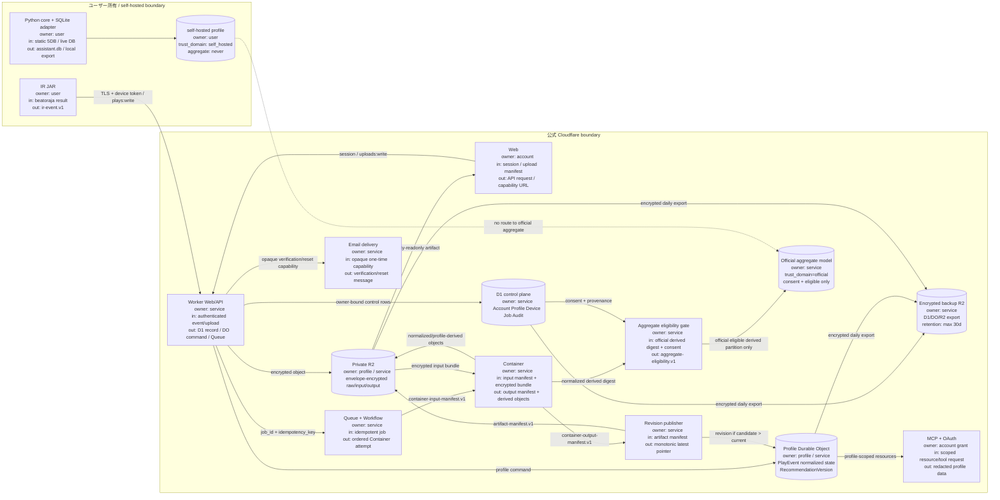

# サービス境界と責務

> この文書の図と契約は、#1 が目指す公式 Cloudflare サービスの目標アーキテクチャである。
> 現行ローカルMVPまたは作業ツリー上の基盤骨格が、これらの境界を実行時にすべて
> 強制していることを意味しない。実装・受入・デプロイの状態は末尾の監査表を参照する。

## 一枚で追跡できるデータフロー

矢印のラベルは主な入力 → 出力、ノード内の `owner` はデータ所有者、`boundary` は信頼境界を示します。

## コンポーネント契約

| コンポーネント | 入力 | 出力 | 所有者 | 境界・禁止事項 |
|---|---|---|---|---|
| beatoraja IR JAR | プレイ結果、allowlist 済み chart 情報 | `ir-event.v1` | ユーザー | BMS本体、replay `keyinput`、任意 `values` は送信しない |
| Python core / local adapter | 5DB の read-only snapshot または live DB | `assistant.db`、ローカル export | ユーザー | beatoraja DBへ書かない。self-hosted データは公式集合へ入れない |
| Web | 認証済み操作、manifest | API request、capability URL | Account | URLに account/profile ID や秘密値を再掲しない |
| Worker / API | bearer credential、契約 JSON | D1/DO command、暗号化 object、job | Service | owner は credential から決定。request body の owner は信用しない |
| D1 | Account/Profile/Device/Job/Audit の制御行 | owner・status・hash・pointer | Service | 生DB、平文 token、MCP用生イベント本文を置かない |
| Profile DO | profile-scoped event/job/revision command | immutable PlayEvent、model/revision state | Profile owner | account/profile 越境 read/write を拒否 |
| Private R2 | encrypted raw/input/output/artifact | hash付き object | Profile owner / Service | profile prefix と envelope key を強制。MCPから raw object を返さない。backup は別 bucket |
| Encrypted backup R2 | D1/DO/R2 の暗号化 export | 30日以内に失効する backup object | Service | 本番 read path やMCPから直接返さない。削除確定後も最大30日で expiry |
| Queue / Workflow | job envelope、idempotency key | retryable Container attempt | Service | duplicate delivery 前提。順序は保証せず latest pointer は revision 比較で保護 |
| Container | container input manifest、encrypted bundle | output manifest、derived object | Service | raw DBをモデル入力へ直接渡さない。SP7 以外を reject |
| Revision publisher | output/artifact manifest | immutable release、latest pointer candidate | Profile owner | `candidate_revision > current_revision` の時だけ pointer 更新 |
| Aggregate eligibility gate | official の normalized digest、同意、source attestation | `aggregate-eligibility.v1` decision | Service | self-hosted、course、DP/PMS、取消済み同意は decision を発行しない |
| MCP + OAuth | PKCE token、scope付き resource/tool | redacted profile data | Account grant | `plays:read` なしに詳細履歴不可。生DB・pending提案・秘密を公開しない |
| Email delivery | 検証・reset用の opaque one-time capability | メール本文 | Service | password/token/プレイpayloadを本文・ログへ出さない |
| Official aggregate | official partition の eligible derived data | 匿名集合モデル | Service / consenting users | `trust_domain=official` かつ `aggregate_eligible=true` のみ。self-hosted UNION は禁止 |

## 分離不変条件

1. `trust_domain` は client payload ではなく、認証済み device/upload context から Worker が付与し、以後 immutable にする。IR client の `aggregate_eligible` は常に `false` とし、集合学習の可否は別の server-attested `aggregate-eligibility.v1` decision で決める。
2. `official` と `self_hosted` は R2 prefix、DO stream、job partition、aggregate input query のキーに含める。同じ profile ID の文字列だけで越境参照できない。
3. 集合学習の入力は `trust_domain=official`、明示同意、`aggregate_eligible=true`、初期範囲 `SP7` をすべて満たす derived record に限る。raw 5DB は常に対象外。
4. `is_course=true` の PlayEvent は個人の履歴・品質には保存するが、通常曲の個人モデル学習へは入れない。
5. 初期範囲外の `DP14`、`DP7`、`PMS`、その他の rule/game mode は、入口・Container・aggregate query の3箇所で拒否する。

## 実装状態の監査（2026-08-11）

### 状態の定義

- **設計済み**: 文書・schema・テストfixtureがあり、実行経路の受入を意味しない。
- **骨格**: 設定、health endpoint、型、または予約ディレクトリだけがある状態。
- **受入済み**: 担当issueの完了条件と自動試験を満たした状態。
- **デプロイ済み**: 対象環境でversion/health/smokeの証跡がある状態。

### 目標契約と実装の対応

| 目標境界 | 監査時点の証拠 | 状態 |
|---|---|---|
| Python local adapter | `src/oraja_training/collect`、`db/store.py`、`serve/app.py` | self-hosted MVP。単一 `player_name` と `assistant.db`、localhost配信を維持 |
| Worker/API | `cloudflare/worker/src/index.ts` の health/version と auth route | 骨格。`/v1/plays`、`/v1/uploads`、capability URL、`/mcp` は未接続 |
| D1 / Profile DO | migration と `ProfileDurableObject` の宣言 | schema/namespaceの骨格。DO `fetch` はready応答で、履歴・revision・`deleteAll()`は未受入 |
| Queue / Workflow / Container | binding宣言、health用 `Dockerfile`、foundation workflow | 骨格。R2入力からの検証・復号・生成・immutable artifactは未受入 |
| IR JAR | `cloudflare/ir/README.md` の予約境界 | 未実装。`IRConnection`、spool、再送、実機契約試験なし |
| OAuth / MCP / AI journal | 契約文書のみ | 未実装。認可metadata、scope middleware、Resources/Tools、pending承認なし |
| β・OSS・公開 | `cloudflare/runbooks/` の一部migration/previewメモ | 未完了。実データ移行、30日β、AGPL公開、改名、production deployは未実施 |

この表は、設計契約を実装済みと誤認しないための監査記録である。作業ツリーにある
未コミット変更、`example.invalid` のorigin、binding宣言、dry-runは、受入済みまたは
本番デプロイ済みの証拠ではない。

### 実装時に再確認する不変条件

1. `/v1/plays` と `/v1/uploads` が実装されるまで、公式データを `official` partitionへ
   入れない。ローカル `assistant.db` は常に `self_hosted` として扱う。
2. Workerが認証済みownerを確定し、request bodyの `account_id`、`profile_id`、
   `trust_domain`、`aggregate_eligible` を認可根拠にしないことをテストする。
3. DO/R2/Queue/Containerが接続された後も、Queueの重複・逆順完了、profile越境、
   旧latest巻戻り、暗号化境界をnegative testで確認する。
4. `/mcp` はOAuth audience、profile、scope、Originを検証し、raw DB/R2 object、
   token、email、会話全文を返さないことを確認する。
5. 実データ移行、削除、復元、公開、production切替は、
   [`epic-1-release-gates.md`](../cloudflare/runbooks/epic-1-release-gates.md) の承認記録が
   そろうまで実行しない。
